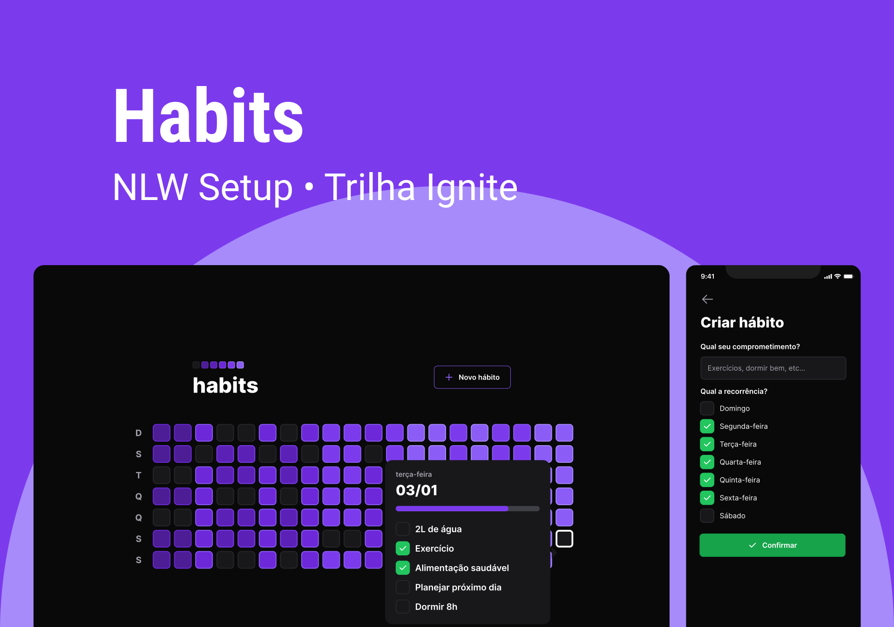

<p align="center">
  
  
  
</p>



<br>
<br>

# Habitto Life 💪

### 🛠️&nbsp; Technologies
##

#### This project was developed using the following technologies:

- [**NodeJS**](https://nodejs.org/)
- [**TypeScript**](https://www.typescriptlang.org/)
- [**Fastify**](https://www.fastify.io/)
- [**Prisma**](https://www.prisma.io/)
- [**ViteJS**](https://vitejs.dev/)
- [**ReactJS**](https://reactjs.org/)
- [**TailwindCSS**](https://tailwindcss.com/)
- [**React Native**](https://reactnative.dev/)
- [**Expo**](https://expo.io/)

### ✨&nbsp; SOLID
##

#### Principles:

- Single Responsibility Principle: Each class has a unique responsibility;
- Open/Closed Principle: Application classes must be open for extension but closed for modification;
- Liskov Substitution Principle: We should be able to replace a parent class with an inheritance from it and everything still works;
- Interface Segregation Principle: Segregate Interfaces;
- Dependency Inversion Principle: Instead of the class fetching the dependencies it needs, the context informs the class of the required dependencies;

### 🚀&nbsp; Getting started
##

Clone the project and access the folder.

```powershell
$ git clone https://github.com/Kyuorhan/nlw-setup-ignite.git
$ cd nlw-setup-ignite
```

### ⚡️&nbsp; Quickstart 
##

#### ⚙️&nbsp; Server

- 📝&nbsp; Install the server dependencies
```powershell
$ cd server
$ npm install
```
- ✨&nbsp; Start the server project
```powershel
$ npx prisma migrate deploy
$ npm run dev
```

#### 🖥️&nbsp; Web 

- 📝&nbsp; Install the web dependencies 
```powershell
$ cd web
$ npm install
```
- ✨&nbsp; Start the web project
```powershell
$ npm run dev
```
<!-- <div align="center">
 
 
</div> -->

<div align="center">
 
 
</div>

<br>

#### 📱&nbsp; Mobile 

- 📝&nbsp; Install the mobile dependencies 
```powershell
$ cd mobile
$ npm install
```
- ✨&nbsp; Start the mobile project
```powershell
$ npx expo start
```
<div align="center">
 
 
</div>

<br>

## 🔖 Layout

You can view the project layout through the links below:

- [**Layout**](<https://www.figma.com/file/442WMJvtAjHkPtZ15b1YqX/Habits-(Community)?node-id=6%3A344&t=ucj9NeYTYwlycTCl-0>)

Remembering that you need to have a [**Figma**](http://figma.com/) account to access it.

---

<div align="center"> Made with 💜 by <b>Jhonny Kyuorhan</b>, follow me on social. 🐱‍💻</div>

<br>

 <div align="center" > 
  <a href="https://www.instagram.com/kyuorhan" target="_blank"> </a>
  <a href="https://discord.gg/nWaPT22Cce" target="_blank"> </a> 
  <a href = "mailto:jkprogrammer96@gmail.com"></a>
  <a href="https://www.linkedin.com/in/jhonny-kyuorhan/" target="_blank"> </a> 
</div>   
